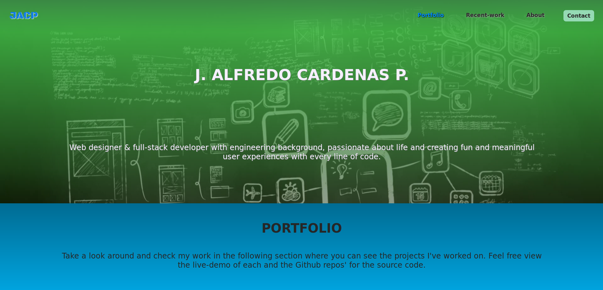
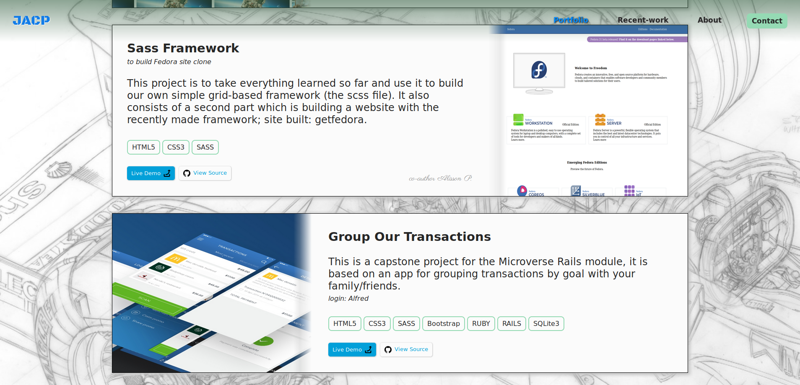

# Portfolio Readme

This is the my Portfolio site. Made for showcasing all my work and projects during my front-end developer study trayectory.

## Portfolio

## Languages
- HTML
- CSS
- SASS

## Usage
In the site you'll find the following sections:
1. Cover
2. Portfolio presentation
3. Portfolio Projects
4. About
5. Contact

In the Portfolio Projects section you'll see a description of the project, the languages used and 2 buttons. One button is for the live link to view a live version of the project and test it and the other is to view the source code in each repository in the Github site.

To access you can simply use the following live link:
- alfredo.tk

## Author
Author | Social Media
:--------------:|:------------:
👤 | - Github: [@NewIncome](https://github.com/NewIncome)
**Alfredo C.** | - Twitter: [@J_A_fredo](https://twitter.com/J_A_fredo)
. | - Linkedin: [Alfredo C.](https://www.linkedin.com/in/alfredo-cardenas-62b021183 )